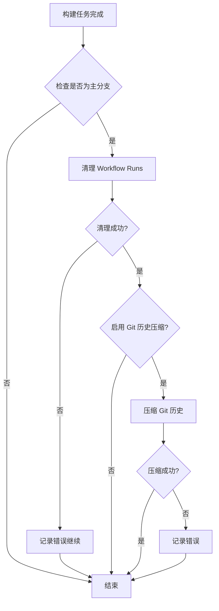

# 设计文档 - GitHub Actions 历史清理功能

## 概述

本设计实现了一个自动化的历史清理系统，包括两个主要组件：
1. **Workflow Runs 清理器**：删除旧的 GitHub Actions 运行记录
2. **Git 历史压缩器**（可选）：压缩 Git 提交历史

系统设计为模块化、可配置，并具有完善的错误处理机制。

## 架构

### 整体架构



### 工作流集成方式

在现有的 `build.yml` 和 `codeql-analysis.yml` 中添加新的清理 job，该 job 依赖于主构建任务的成功完成。

## 组件和接口

### 1. Workflow Runs 清理组件

**实现方式：** 使用 GitHub Actions Marketplace 中的成熟 action

**推荐 Action：** `Mattraks/delete-workflow-runs@v2`

**配置参数：**
```yaml
inputs:
  token: ${{ secrets.GITHUB_TOKEN }}
  repository: ${{ github.repository }}
  retain_days: 0  # 不按天数保留
  keep_minimum_runs: 10  # 保留最近 10 次
  delete_workflow_pattern: 'all'  # 清理所有工作流
```

**权限要求：**
- `actions: write` - 删除 workflow runs
- `contents: read` - 读取仓库信息

### 2. Git 历史压缩组件

**实现方式：** 自定义 shell 脚本

**核心逻辑：**
```bash
# 1. 获取最近 N 次提交的 SHA
# 2. 创建备份标签
# 3. 使用 git rebase 或创建新的 orphan 分支
# 4. 保留最近 10 次提交
# 5. Force push 到远程
```

**两种实现策略：**

#### 策略 A：保留最近 N 次完整提交（推荐）
```bash
# 获取第 11 次提交的 SHA
CUTOFF_SHA=$(git rev-parse HEAD~10)
# 创建备份
git tag backup-$(date +%Y%m%d-%H%M%S) HEAD
# Rebase 到截断点
git rebase -i $CUTOFF_SHA
# Force push
git push -f origin main
```

#### 策略 B：压缩为单个提交（激进）
```bash
# 创建孤立分支
git checkout --orphan temp_branch
git add -A
git commit -m "Compressed history - Original commits: $(git rev-list --count HEAD)"
# 替换主分支
git branch -D main
git branch -m main
git push -f origin main
```

### 3. 配置管理组件

**环境变量：**
```yaml
env:
  CLEANUP_ENABLED: 'true'
  CLEANUP_WORKFLOW_RUNS: 'true'
  CLEANUP_GIT_HISTORY: 'false'  # 默认禁用
  KEEP_RUNS_COUNT: '10'
  KEEP_COMMITS_COUNT: '10'
  GIT_CLEANUP_STRATEGY: 'preserve'  # 'preserve' 或 'squash'
```

**配置验证：**
- 在执行前验证所有必需的环境变量
- 提供默认值以防配置缺失
- 对危险操作（Git 历史压缩）要求显式启用

## 数据模型

### Workflow Run 元数据
```typescript
interface WorkflowRun {
  id: number;
  name: string;
  created_at: string;
  status: 'completed' | 'in_progress' | 'queued';
  conclusion: 'success' | 'failure' | 'cancelled';
}
```

### Git Commit 元数据
```typescript
interface CommitInfo {
  sha: string;
  message: string;
  author: string;
  date: string;
  parent_count: number;
}
```

### 清理结果
```typescript
interface CleanupResult {
  workflow_runs_deleted: number;
  commits_before: number;
  commits_after: number;
  backup_tag?: string;
  errors: string[];
}
```

## 错误处理

### 错误分类

1. **权限错误**
   - 缺少必要的 GitHub token 权限
   - 处理：跳过清理，输出警告信息

2. **API 限流错误**
   - GitHub API 请求超过限制
   - 处理：使用指数退避重试，最多 3 次

3. **Git 操作错误**
   - Force push 失败
   - Rebase 冲突
   - 处理：回滚到备份标签，记录详细错误

4. **配置错误**
   - 无效的环境变量值
   - 处理：使用默认值并警告

### 错误恢复策略

```yaml
# 为 Git 历史压缩创建安全网
- name: 创建恢复点
  run: |
    git tag recovery-point-$(date +%Y%m%d-%H%M%S) HEAD
    git push origin --tags

- name: 压缩历史
  id: compress
  continue-on-error: true
  run: |
    # 压缩逻辑

- name: 验证结果
  if: steps.compress.outcome == 'failure'
  run: |
    echo "历史压缩失败，仓库保持原状"
    git reset --hard recovery-point-*
```

## 安全性考虑

### 1. 权限最小化原则
```yaml
permissions:
  actions: write      # 仅用于删除 workflow runs
  contents: write     # 仅用于 Git 历史操作
  pages: write        # 保留原有权限
  id-token: write     # 保留原有权限
```

### 2. 分支保护
- 只在 `main` 分支执行清理
- Pull Request 中完全禁用清理功能
- 使用条件判断确保不会误操作

### 3. 审计日志
- 记录每次清理的详细信息
- 保存备份标签供紧急恢复
- 输出清理前后的对比数据

### 4. 回滚机制
```bash
# 如果需要恢复
git fetch origin
git checkout main
git reset --hard backup-YYYYMMDD-HHMMSS
git push -f origin main
```

## 测试策略

### 1. 单元测试（脚本验证）
- 测试环境变量解析
- 测试 Git 命令生成
- 测试错误处理逻辑

### 2. 集成测试
- 在测试仓库中验证完整流程
- 测试权限不足的场景
- 测试 API 限流处理

### 3. 手动测试清单
- [ ] 在 fork 仓库中测试完整流程
- [ ] 验证 workflow runs 清理效果
- [ ] 验证 Git 历史压缩效果
- [ ] 测试错误恢复流程
- [ ] 验证备份标签创建
- [ ] 测试 PR 中的行为（应跳过清理）

### 4. 监控指标
- Workflow runs 数量变化
- 仓库大小变化
- 清理任务执行时间
- 失败率和错误类型

## 实现细节

### Job 依赖关系

```yaml
jobs:
  build:
    # 现有构建逻辑
    
  deploy:
    needs: build
    # 现有部署逻辑
    
  cleanup:
    needs: [build, deploy]  # 依赖构建和部署成功
    if: github.event_name != 'pull_request' && github.ref == 'refs/heads/main'
    runs-on: ubuntu-latest
    permissions:
      actions: write
      contents: write
```

### 配置文件结构

建议创建 `.github/cleanup-config.yml` 存储配置：
```yaml
workflow_runs:
  enabled: true
  keep_count: 10
  
git_history:
  enabled: false  # 默认禁用
  strategy: preserve  # preserve 或 squash
  keep_count: 10
  create_backup: true
```

### 执行顺序

1. **前置检查**
   - 验证分支
   - 验证权限
   - 加载配置

2. **Workflow Runs 清理**
   - 获取所有 runs
   - 按时间排序
   - 删除超出保留数量的 runs
   - 记录结果

3. **Git 历史压缩**（如果启用）
   - 创建备份标签
   - 执行压缩策略
   - 验证结果
   - Force push

4. **后置处理**
   - 生成清理报告
   - 输出统计信息
   - 清理临时文件

## 性能考虑

- **API 调用优化**：批量删除 workflow runs 而非逐个删除
- **Git 操作优化**：使用 shallow clone 减少数据传输
- **并发控制**：使用 concurrency 组防止多个清理任务同时运行
- **超时设置**：为清理任务设置合理的超时时间（建议 10 分钟）

## 兼容性

- **GitHub Actions**：需要 GitHub Actions v3+
- **Git 版本**：需要 Git 2.23+（支持 `git switch`）
- **Shell**：使用 bash 确保跨平台兼容
- **Node.js**：如果使用 JavaScript action，需要 Node 16+

## 文档和维护

### 用户文档
- README 中添加清理功能说明
- 提供配置示例
- 说明风险和注意事项

### 维护指南
- 定期检查依赖的 action 版本
- 监控 GitHub API 变更
- 更新备份恢复文档
